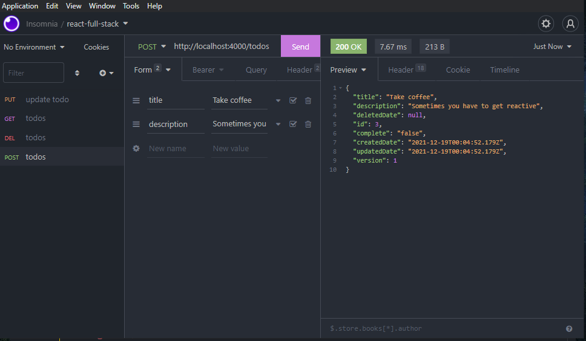
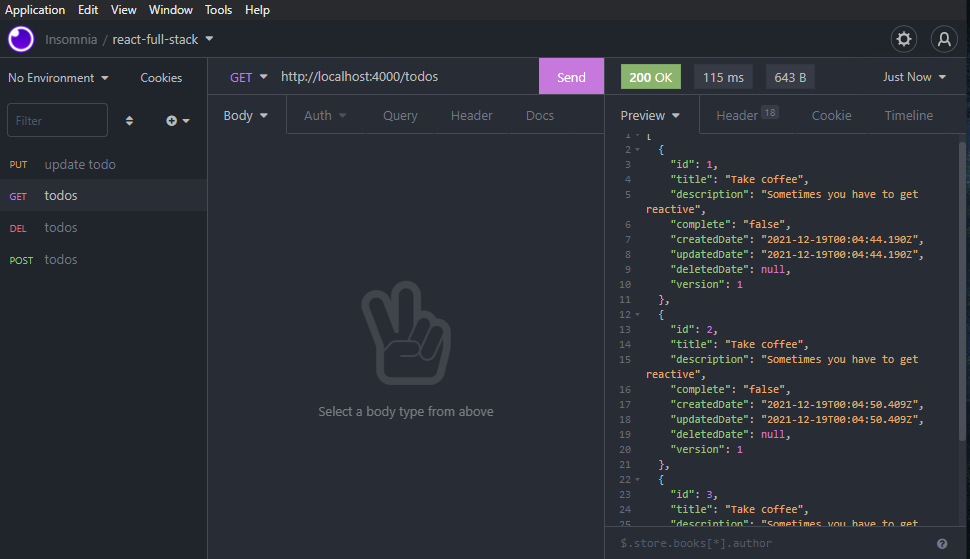
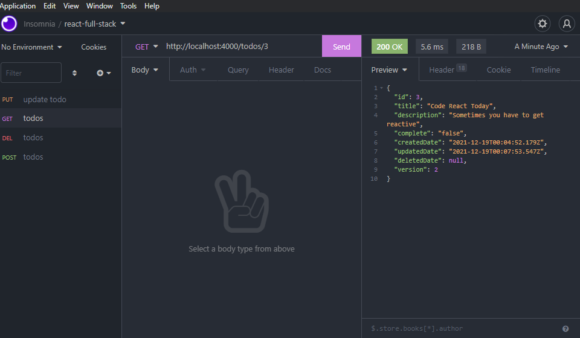
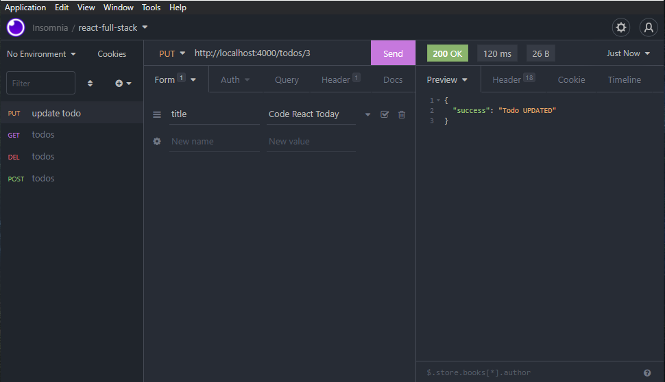
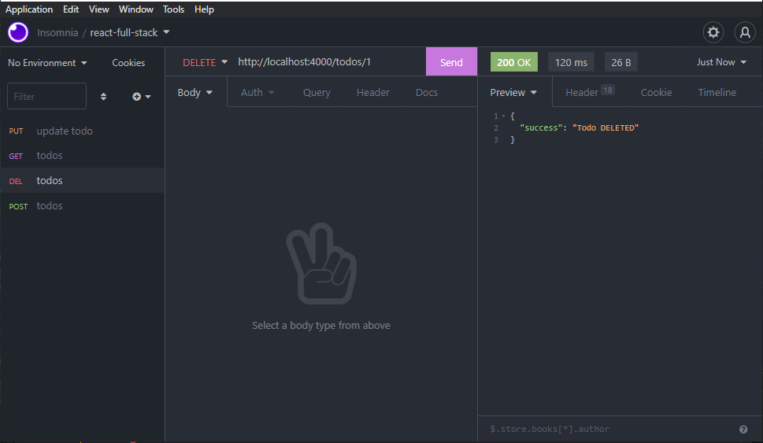
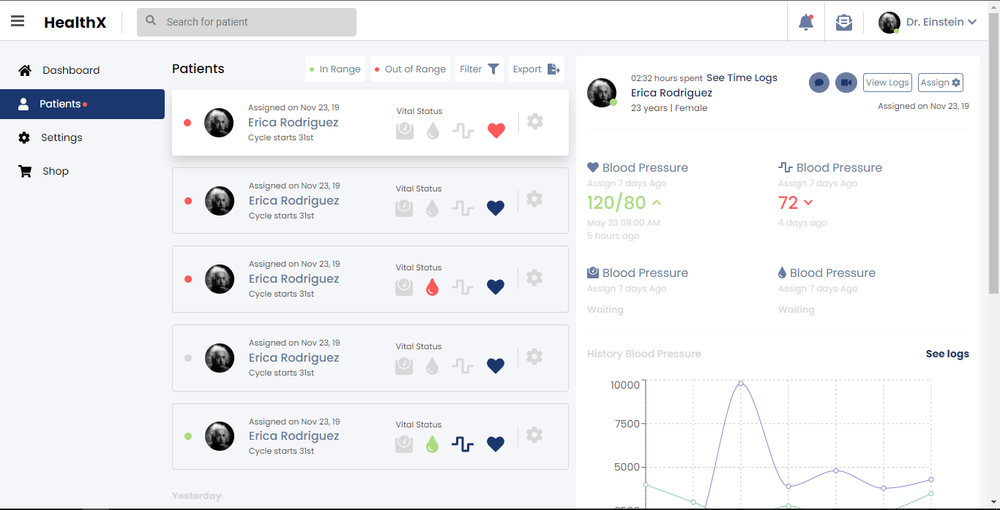

# React fullstack [Documentation]

This application contains a simple ExpressJs Server and ReactJs Frontend. Managed using Lerna and Yarn workspaces.

## Usage

To run this application and is made up of two key packages **@react-full-stack/backend** and **@react-full-stack/backend**. To run it, one aught to have installed Nodejs and Yarn package manager. First, you will have to clone the repository with git.

```shell
git clone https://github.com/andrewkariuki/react-full-stack.git
```

Then install the required npm packages.

```shell
cd react-full-stack && yarn install
```

## Backend

The backend is powered using TypeORM and PostgreSQL DBMS. So, to ensure everything is working correctly, there is need to install PostgreSQL and create a database with any name. After which, you will need to configure the **ormconfig.yml** file in this manner. The file is found in the **/packages/backend** folder.

```yml
    development: # development connection
        type: "postgres"
        host: "localhost"
        port: 5432 # database port
        username: "postgres" #database user name
        password: "1234" # database user password
        database: "todos" # database name
```

__Note: Do this specifically on the default and development connection options__
After the ORM configuration, you will have to run the migrations for the database. With this you have two options

1. You can

```shell
cd packages/backend && yarn migrate
```

2. Or, in the root **react-full-stack** folder run

``shell
yarn migrate:db
``

Running the Backend API. With in the root directory run the command below and the server will start up on the url **http://localhost:4000/** by default. Though you can configure a specific **PORT** in the **.env** file

```shell
yarn run start:backend
```

This backend contains a minimalist Todo Application. Meaning, it exposes the following API end points.

```shell
GET http://localhost:4000/todos
POST http://localhost:4000/todos
GET http://localhost:4000/todos/:id
PUT http://localhost:4000/todos/:id
DELETE http://localhost:4000/todos/:id
```

The url **GET http://localhost:4000/todos** gives room for conditional queries with sort, limit and skip being the key option.

The todo model will require you to enter a **title** and a **description** with an optional **complete** field when performing an update on a todo item.

### Backend Expectations and Usage

**Add todos**
Requires

1. title
2. description



**Search todos**
Requires

1. _ || sort || limit || limit&skip  as request query parameters



**Search todo by id**
Requires

1. id as a parameter



**Update todo by id**
Requires

1. id as a parameter
2. title ||description || complete



**Delete todo by id**
Requires

1. id as a parameter



## Frontend

The frontend is a react application. Run the below command at the root folder of the application.

```shell
yarn start:frontend
```

The web app will start on the is url **http://localhost:3000** the core UI is under **http://localhost:3000/patients** route.

### Fronted Expectations


